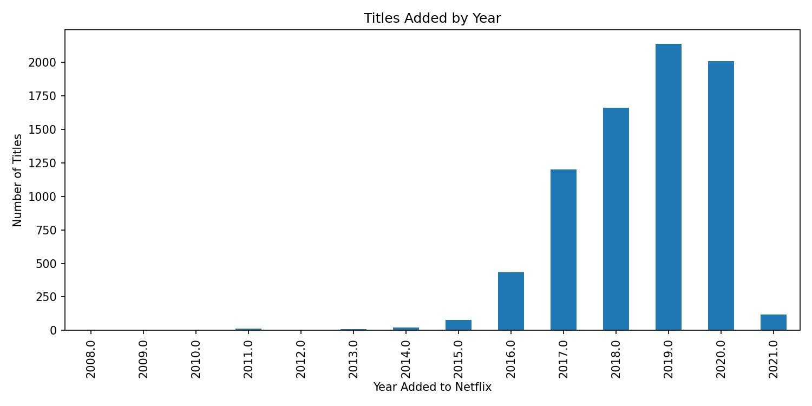
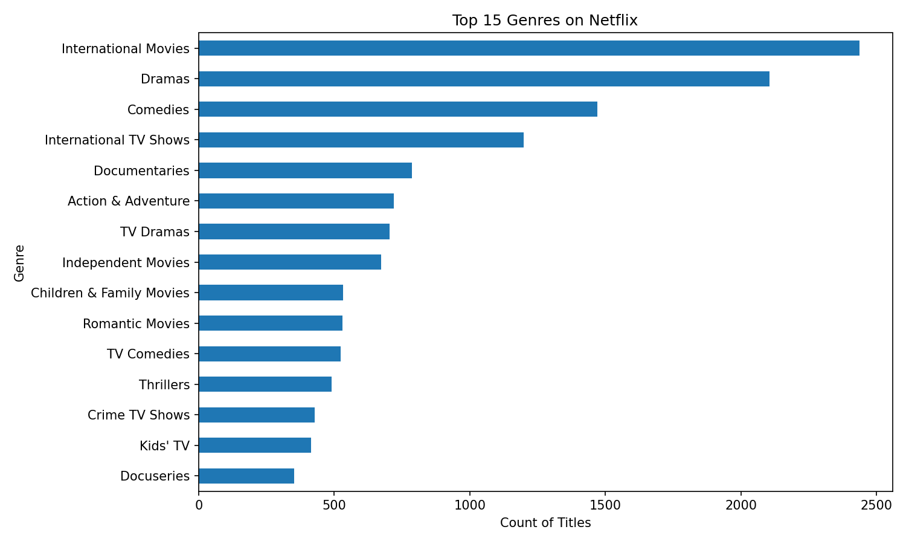
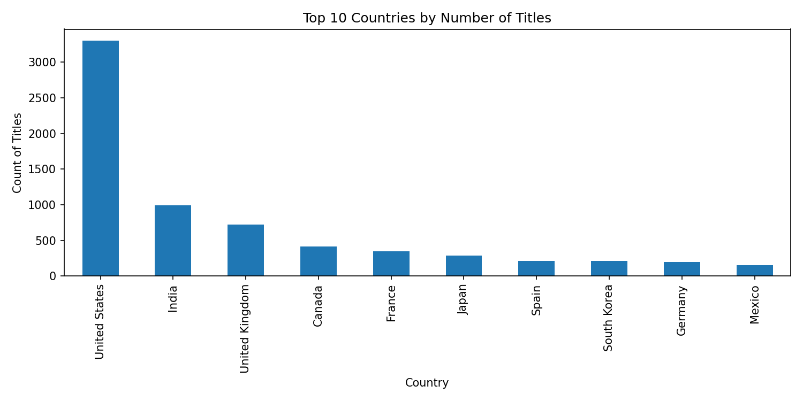
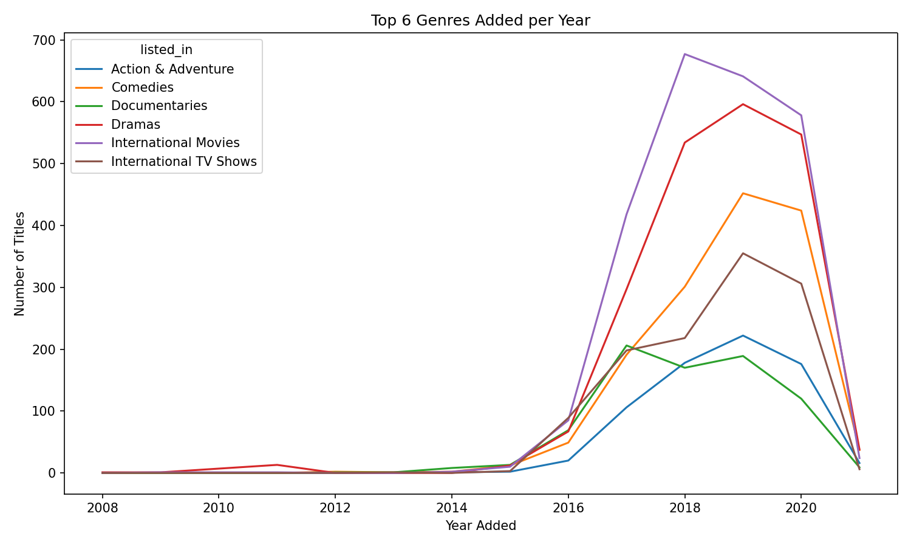

# Netflix Retention Case Study
Goal: explore retention by cohort, content mix trends, country segmentation, and a simple churn baseline.

## Structure
- data/raw/        # original data
- data/processed/  # cleaned data
- notebooks/       # main analysis notebook
- figures/         # exported charts

## How to run
1) python3 -m venv .venv && source .venv/bin/activate
2) pip install -r requirements.txt
3) jupyter notebook notebooks/netflix_retention.ipynb

4) ## Preview

